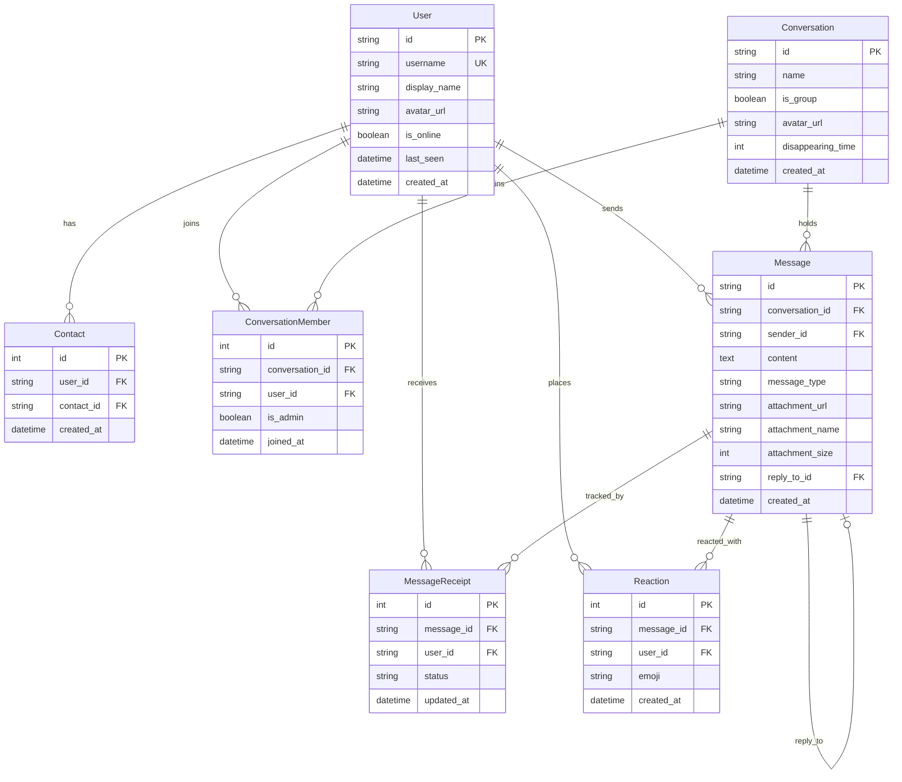

# Signal Clone — Secure Messaging Platform

A full-stack, privacy-focused real-time messaging application replicating Signal's design, user experience, and core messaging workflows.

Built as part of the **SDE Fullstack Assignment**.

---

## 🚀 Features & Assignment Criteria Matrix

### 1. Authentication & Onboarding
- [x] **Mocked Phone / Username Registration**: Register using phone number (e.g., `+15550100`) or username.
- [x] **Mocked OTP Verification**: Fixed OTP verification code (`123456`).
- [x] **Profile Setup**: Custom display name and auto-generated / uploaded avatar URL.
- [x] **Session Persistence**: Persistent login session stored securely in `localStorage`.

### 2. Contacts & Conversation List
- [x] **Signal Dual-Pane Layout**: Left sidebar conversation list with active chat window.
- [x] **Recent Activity Sorting**: Conversations automatically sort by latest message timestamp.
- [x] **Search**: Filter conversations and contacts dynamically.
- [x] **Add Contact**: Search and add existing registered users by phone/username.
- [x] **Unread Badges & Previews**: Real-time unread message counts and last message previews.
- [x] **Online & Last-Seen Status**: Real-time indicator for user online state and timestamped last seen.

### 3. One-on-One Messaging
- [x] **Real-Time WebSockets**: Instant message delivery and status updates over WebSocket connections.
- [x] **Timestamps**: Precise message timestamps formatted per Signal UI specs.
- [x] **Delivery & Read Receipts**: Checkmark indicator lifecycle (`sending` ⏱️ ➔ `sent` ✓ ➔ `delivered` ✓✓ ➔ `read` blue ✓✓).
- [x] **Typing Indicators**: Real-time "typing..." status updates for participants.
- [x] **Database Persistence**: All 1-on-1 messages persisted in SQLite.

### 4. Group Messaging
- [x] **Group Creation**: Create multi-user groups with group names and avatars.
- [x] **Group Real-Time Messaging**: Distribute messages instantly across all group members.
- [x] **Member Management**: View member lists, assign admin roles, add new members, or remove existing members (admin-only permissions).

### 5. Signal UI / UX Experience
- [x] **Authentic Signal Aesthetic**: Custom Signal blue accents (`#2c6bed`), dark/light mode toggle, sleek message bubbles, and responsive dual-pane desktop / drawer mobile views.
- [x] **Notifications & Toasts**: In-app toast alerts for incoming messages and actions.
- [x] **Placeholder Modals**: "Coming Soon" dialogs for Voice/Video Calls, Stories, and Linked Devices.
- [x] **E2EE Badge**: Visual simulated End-to-End Encryption status header.

### 6. Bonus Features Implemented
- [x] **Attachments**: Support for image and document file uploads served via FastAPI static storage.
- [x] **Emoji Reactions**: React to messages with emojis (👍, ❤️, 😂, 😮, 😢, 🙏).
- [x] **Quoted Replies**: Select and reply to specific messages with preview context.
- [x] **Disappearing Messages**: Configurable message expiration timers (Off, 5s, 1m, 1h, 1d).
- [x] **Dark / Light Mode**: Seamless theme switcher preserving user preference.

---

## 🛠️ Tech Stack

* **Frontend**: Next.js 16 (React 19, TypeScript, Vanilla CSS design system matching Signal).
* **Backend**: Python 3.14 + FastAPI.
* **Database**: SQLite3 managed via SQLAlchemy ORM.
* **Real-time**: HTML5 WebSockets managed by `ConnectionManager`.
* **Testing**: Pytest (`backend/test_main.py`).

---

## 🏛️ System Architecture

```
                               ┌───────────────────────────────────┐
                               │       Next.js 16 (Frontend)       │
                               │  (React 19, TS, Signal Styling)   │
                               └─────────────────┬─────────────────┘
                                                 │
                                       REST API  │  WebSockets
                                       (HTTP)    │  (ws://)
                                                 ▼
┌───────────────────────────────────────────────────────────────────────────────────┐
│                              FastAPI Backend Server                               │
│                                                                                   │
│  ┌──────────────────────┐   ┌──────────────────────┐   ┌──────────────────────┐  │
│  │   Auth & User API    │   │  Conversations API   │   │  WebSocket Manager   │  │
│  └──────────┬───────────┘   └──────────┬───────────┘   └──────────┬───────────┘  │
└─────────────┼──────────────────────────┼──────────────────────────┼───────────────┘
              │                          │                          │
              ▼                          ▼                          ▼
┌───────────────────────────────────────────────────────────────────────────────────┐
│                                 SQLAlchemy ORM                                    │
└────────────────────────────────────────┬──────────────────────────────────────────┘
                                         │
                                         ▼
┌───────────────────────────────────────────────────────────────────────────────────┐
│                              SQLite3 Database File                                │
│                             (signal_clone.db)                                     │
└───────────────────────────────────────────────────────────────────────────────────┘
```

### Real-Time WebSocket Event Lifecycle
1. **Connection**: Client establishes `ws://localhost:8000/ws/{user_id}` and triggers broadcast of `online` status.
2. **Messaging**: Client sends JSON message payload `{"type": "message", ...}`. Backend stores it in DB, broadcasts to room participants, and sends back `delivered` / `read` receipts.
3. **Typing Status**: Client emits `{"type": "typing", "conversation_id": "...", "is_typing": true}` which broadcasts instantly to target room.
4. **Reactions**: Emojis sent via WebSocket broadcast to update message reaction arrays live.

---

## 🗄️ Database Schema

The database schema is defined in `backend/models.py` using SQLAlchemy.



---

## 📡 API Reference Overview

### 🔑 Authentication & Users (`/api/auth`)
* `POST /api/auth/register` — Register new user with username/phone.
* `POST /api/auth/login` — Request login OTP (`123456`).
* `POST /api/auth/verify-otp` — Verify OTP code and retrieve user token profile.
* `GET /api/auth/me` — Retrieve current authenticated user profile (`X-User-Id` header).
* `PUT /api/auth/me` — Update display name and avatar URL.

### 👥 Contacts (`/api/contacts`)
* `GET /api/contacts` — List all contacts of current user.
* `POST /api/contacts` — Add user to contacts by username/phone.
* `GET /api/contacts/search?query=...` — Search registered users.

### 💬 Conversations (`/api/conversations`)
* `GET /api/conversations` — Retrieve all active 1-on-1 and group conversations sorted by recent activity.
* `POST /api/conversations/direct` — Start or get 1-on-1 conversation with a contact.
* `POST /api/conversations/group` — Create group conversation with title & initial members.
* `GET /api/conversations/{id}` — Get single conversation details with member list.
* `POST /api/conversations/{id}/members` — Add members to group (admin).
* `DELETE /api/conversations/{id}/members/{user_id}` — Remove member from group (admin).
* `PUT /api/conversations/{id}/disappearing` — Update disappearing messages timer.

### 📩 Messages & Attachments (`/api/conversations/{id}/messages`)
* `GET /api/conversations/{id}/messages` — Fetch paginated conversation message history.
* `POST /api/conversations/{id}/messages` — Send text message / reply via HTTP REST.
* `POST /api/messages/{id}/react` — Toggle emoji reaction on message.
* `POST /api/upload` — Upload attachment file (images, documents).

### ⚡ WebSockets (`/ws/{user_id}`)
* Connection endpoint handling real-time bi-directional message frames, typing indicators, receipts, and user presence notifications.

---

## 💻 Local Setup & Running Instructions

### Prerequisites
* Python 3.10+
* Node.js 18+ & npm

---

### Step 1: Run Backend (FastAPI)

1. Navigate to the backend directory:
   ```bash
   cd backend
   ```
2. Activate virtual environment (if not already active):
   * **Windows**:
     ```powershell
     .\.venv\Scripts\activate
     ```
   * **macOS/Linux**:
     ```bash
     source .venv/bin/activate
     ```
3. Install dependencies:
   ```bash
   pip install -r requirements.txt
   ```
4. Seed the database with sample users and messages:
   ```bash
   python seed.py
   ```
5. Run the FastAPI development server:
   ```bash
   uvicorn main:app --reload --port 8000
   ```
   * The API server will run at `http://localhost:8000`.
   * Interactive API docs (Swagger UI) available at `http://localhost:8000/docs`.

---

### Step 2: Run Frontend (Next.js)

1. Open a new terminal and navigate to the frontend directory:
   ```bash
   cd frontend
   ```
2. Install Node dependencies:
   ```bash
   npm install
   ```
3. Run the development server:
   ```bash
   npm run dev
   ```
4. Open [http://localhost:3000](http://localhost:3000) in your browser.

---

### 🧪 Running Unit Tests

Run backend tests via pytest:
```bash
cd backend
.\.venv\Scripts\python.exe -m pytest
```

---

## 🌐 Cloud Deployment Guide

### Deploying Backend (Render / Railway / Fly.io)
1. Push repository to GitHub.
2. Create a Python Web Service on Render / Railway.
3. Root Directory: `backend`
4. Build Command: `pip install -r requirements.txt`
5. Start Command: `uvicorn main:app --host 0.0.0.0 --port $PORT`

### Deploying Frontend (Vercel)
1. Connect repository on Vercel.
2. Root Directory: `frontend`
3. Environment Variables:
   * `NEXT_PUBLIC_API_BASE_URL`: URL of deployed FastAPI backend (e.g., `https://your-signal-backend.onrender.com`)
   * `NEXT_PUBLIC_WS_BASE_URL`: WebSocket URL of deployed backend (e.g., `wss://your-signal-backend.onrender.com`)
4. Click **Deploy**.

---

## 📝 Assumptions Made

1. **Mocked Auth & OTP**: Real SMS gateways and Signal protocol curve25519 key exchanges are mocked using fixed OTP verification (`123456`) and simulated E2EE encryption status badges.
2. **Database Engine**: Uses SQLite file-based storage (`signal_clone.db`) suitable for demonstration and local development.
3. **File Attachments**: Stored locally in `backend/uploads/` and served via static route `/uploads`.

---

## 📄 License
This project is open-source under the MIT License. Created for SDE Fullstack evaluation.
